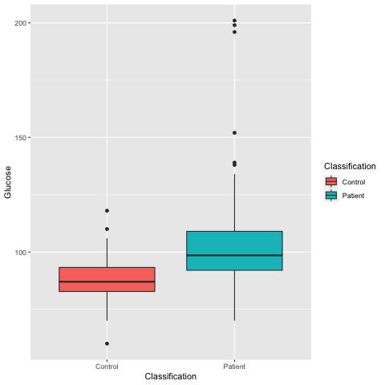
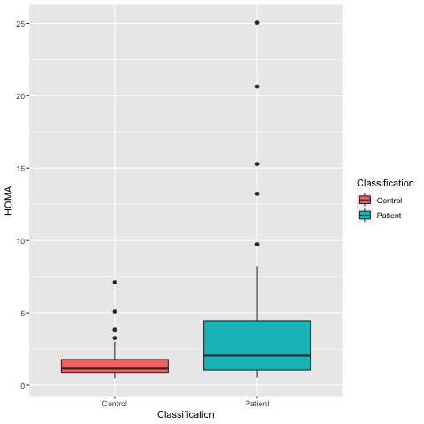
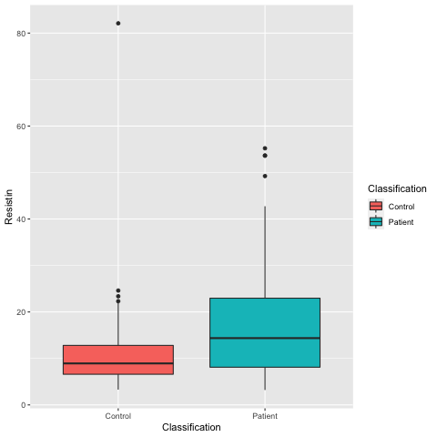

```{r setup, include=FALSE}
knitr::opts_chunk$set(
  echo = FALSE, message = FALSE, warning = FALSE, fig.width = 6, fig.height = 6
)
```


## 1. Summary statistics
```{r}
candat <- read.csv("../clean_data/cleandata.csv")
n.missing <- sum(is.na(candat))
n.row <- nrow(candat)
count <- table(candat$Classification)
descriptive <- t(apply(candat[-10], 2, summary))
row.names(descriptive) <- colnames(candat)[-10]
t.row.name <- c("Age (years)", "BMI (kg/$m^2$)","Glucose (mg/dL)",
                "Insulin ($\\mu$U/mL)", "HOMA","Leptin (ng/mL)", 
                "Adiponectin ($\\mu$g/mL)","Resistin (ng/mL)","MCP-1(pg/dL)")
rownames(descriptive) <- t.row.name
knitr::kable(descriptive, digits = 4, caption = "Table 1. Summary Statistics", escape = FALSE) 
```
There are total `r n.row` participants in the study with `r count[1]` healthy controls and `r count[2]` breast cancer patients. There are `r n.missing` missing values in the data set.


## 2. UVA: Mann-Whitney U tests for distribution differences between two populations
```{r}
# Mann-Whitney U tests
MWtest <- apply(candat[-10],2,function(x) wilcox.test(x~candat$Classification))
MWtest_sum = data.frame(Reduce(rbind, MWtest))
row.names(MWtest_sum) <- t.row.name
knitr::kable(MWtest_sum[c(-2,-4,-5,-6,-7)], col.names = c("U statistic", "p-value"), caption ="Table 2. Mann-Whitney U Test Results")
```
Based on the result table, Glucose, Insulin, HOMA and Resistin differs significantly between two populations because p-values are less than 0.05.\

Boxplots for Glucose, Insulin, HOMA and Resistin are shown below.\










## 3. MVA Logistic Regression Model
```{r}
library(sjPlot)
library(sjmisc)
library(sjlabelled)
# Multivariate analysis
log_1 <- glm(Classification ~ Age + BMI + Glucose + Insulin + HOMA + Resistin + MCP.1, data=candat, family=binomial(link="logit"))
log_2 <- glm(Classification ~ BMI + Glucose + Insulin + HOMA + Resistin + MCP.1, data=candat, family=binomial(link="logit"))
log_3 <- glm(Classification ~ BMI + Glucose + Insulin + HOMA + Resistin, data=candat, family=binomial(link="logit"))
log_4 <- glm(Classification ~ BMI + Glucose + Insulin + Resistin, data=candat, family=binomial(link="logit"))
log_5 <- glm(Classification ~ BMI + Glucose + Resistin, data=candat, family=binomial(link="logit"))
tab_model(log_1,log_2,log_3,log_4,log_5,dv.labels = c("MVA Model 1","MVA Model 2","MVA Model 3","MVA Model 4","MVA Model 5"), show.ci = F)
```
Base on the multivariate logistic regression model, BMI, Glucose and Resistin have significant relationships with the odds of being breast cancer patients. 


## 4. Working directory and session info
```{r}
getwd()
devtools::session_info()
```
